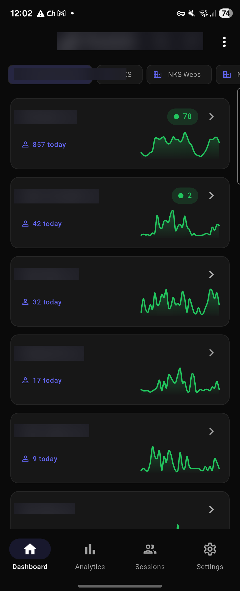
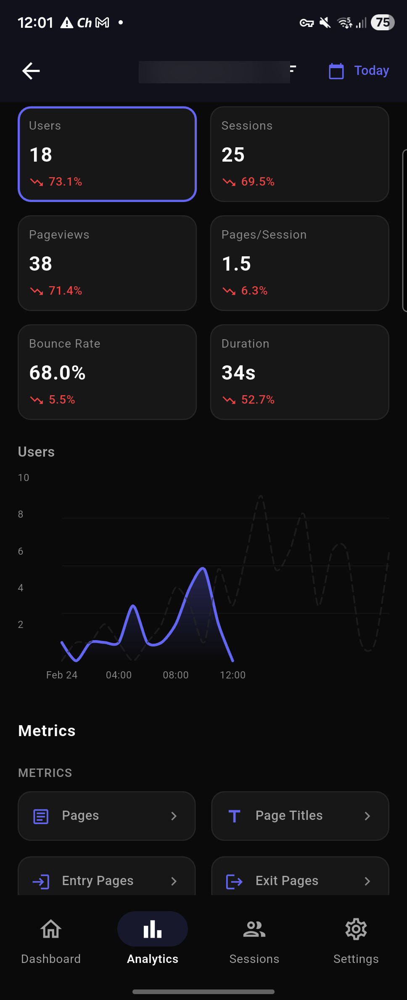
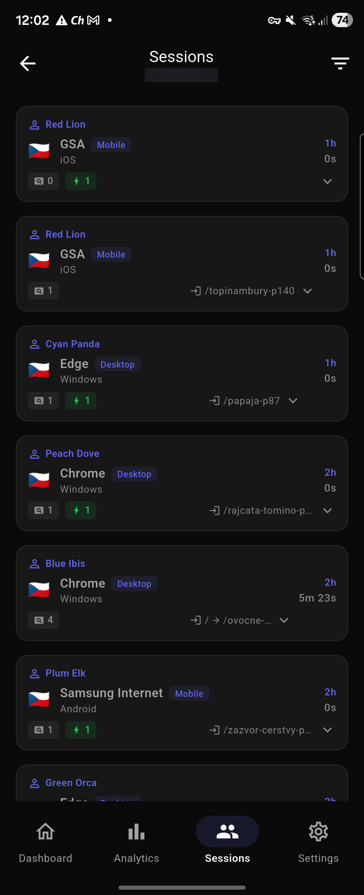
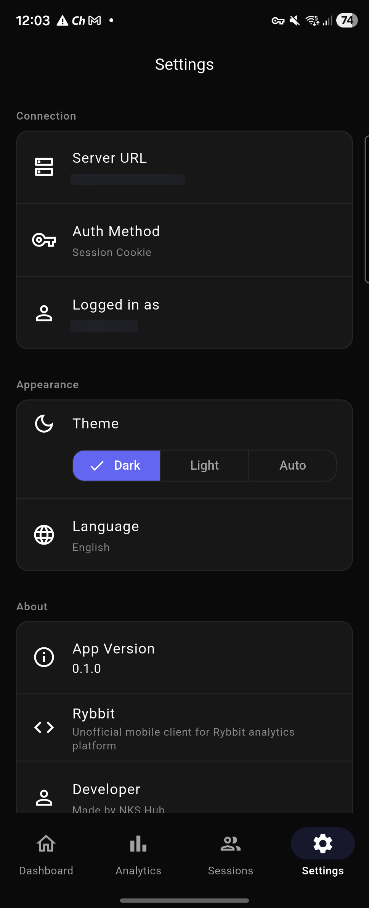
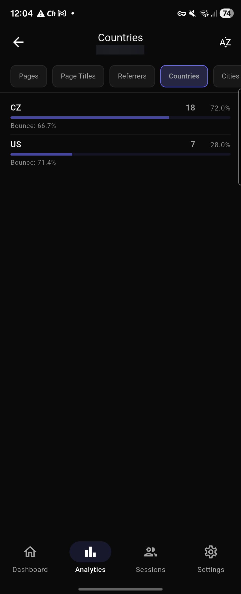
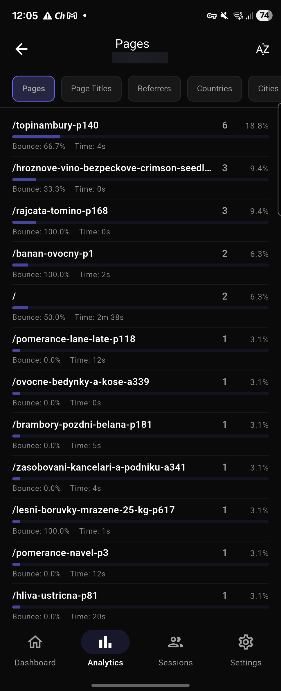
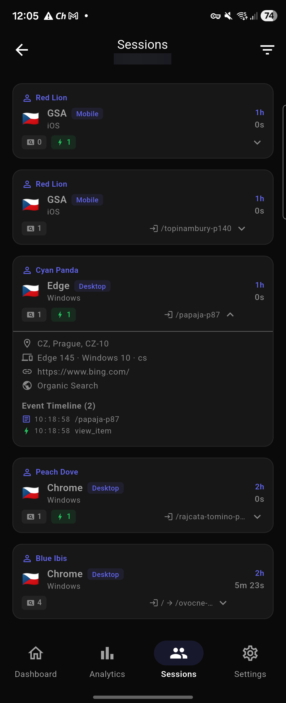

<p align="center">
  
</p>

<h1 align="center">🐸 Rybbit Mobile</h1>

<p align="center">
  Unofficial Flutter mobile client for <a href="https://github.com/rybbit-io/rybbit">Rybbit</a> — open-source, privacy-friendly web analytics.
</p>

<p align="center">
  <a href="https://github.com/nks-hub/rybbit-app/stargazers"></a>
  <a href="https://github.com/nks-hub/rybbit-app/network/members"></a>
  <a href="https://github.com/nks-hub/rybbit-app/issues"></a>
  <a href="https://github.com/nks-hub/rybbit-app/blob/master/LICENSE"></a>
  <a href="https://github.com/nks-hub/rybbit-app/releases"></a>
</p>

<p align="center">
  
  
  
  
</p>

---

## Screenshots

<p align="center">
  
  &nbsp;&nbsp;
  
  &nbsp;&nbsp;
  
  &nbsp;&nbsp;
  
</p>

<details>
<summary>More screenshots</summary>
<p align="center">
  
  &nbsp;&nbsp;
  
  &nbsp;&nbsp;
  
</p>
</details>

---

## Features

### Dashboard & Analytics
- Multi-site dashboard with real-time visitor counts and organization filtering
- Time-series charts with period comparison (current vs previous)
- Selectable metrics: users, sessions, pageviews, pages/session, bounce rate, duration
- Flexible time range picker (today, yesterday, 7/30 days, week, month, year, custom)
- Advanced filtering by country, browser, OS, device, referrer, pathname and more

### Detailed Metrics
- **Pages** — top pages with visitor and session counts
- **Referrers** — traffic sources breakdown
- **Countries** — geographic distribution with flag indicators
- **Devices** — browser, OS, device type, screen resolution stats

### Performance (Core Web Vitals)
- LCP, CLS, FCP, TTFB, INP monitoring
- Good/Needs Improvement/Poor ratings with color coding
- Performance trends over time
- Breakdown by dimension (pages, countries, devices, browsers, OS)

### Events & Custom Tracking
- Custom event names overview with occurrence counts
- Event properties breakdown per event
- Events over time chart
- Outbound links tracking

### Goals & Funnels
- Goal creation/editing (path-based and event-based)
- Conversion rate tracking
- Funnel visualization with step-by-step dropoff analysis

### Sessions & Users
- Session list with country flags, browser info, entry pages
- Session detail with full event timeline
- Identified user display with traits (username, email)
- Session replay event viewer

### Error Tracking
- JavaScript error list with occurrence counts
- Sessions affected per error

### Site Management
- Site configuration (tracking toggles, excluded IPs/countries)
- Organization management with member listing

### Settings
- Dark / Light / Auto theme
- 11 languages
- Server connection and auth method display

---

## Supported Languages

| Language | Code | Language | Code |
|----------|------|----------|------|
| English | `en` | Japanese | `ja` |
| Czech | `cs` | Korean | `ko` |
| German | `de` | Polish | `pl` |
| Spanish | `es` | Portuguese | `pt` |
| French | `fr` | Chinese | `zh` |
| Italian | `it` | | |

---

## Getting Started

### Prerequisites

- Flutter SDK 3.38+
- Android SDK / Xcode (for iOS)
- A running [Rybbit](https://github.com/rybbit-io/rybbit) instance

### Setup

```bash
git clone https://github.com/nks-hub/rybbit-app.git
cd rybbit-app

# Install dependencies
flutter pub get

# Generate code (Freezed models, JSON serialization)
flutter pub run build_runner build --delete-conflicting-outputs

# Generate localizations
flutter gen-l10n

# Run
flutter run
```

### Environment

Copy `.env.example` to `.env` and fill in your values:

```bash
cp .env.example .env
```

The `.env` file is automatically loaded at build time via `--dart-define-from-file`:

```bash
# Run with .env
flutter run --dart-define-from-file=.env

# Build with .env
flutter build apk --dart-define-from-file=.env
```

Currently supported variables:

| Variable | Required | Description |
|----------|----------|-------------|
| `SENTRY_DSN` | No | Sentry error tracking DSN. App works without it. |

### Authentication

Two auth methods supported:

1. **Email + Password** — Standard login with session cookies
2. **API Key** — Direct API key authentication

Enter your Rybbit server URL (e.g. `https://analytics.example.com`) and credentials on the login screen.

---

## Tech Stack

| Layer | Technology |
|-------|-----------|
| Framework | Flutter 3.38+ / Dart 3.10+ |
| State Management | Riverpod |
| Routing | go_router |
| HTTP Client | Dio with cookie management |
| Local Storage | Hive + Flutter Secure Storage |
| Charts | fl_chart |
| Serialization | Freezed + json_serializable |
| Localization | Flutter gen-l10n (ARB files) |
| Error Tracking | Sentry (optional, via `--dart-define`) |

---

## Architecture

Feature-first modular architecture:

```
lib/
├── core/
│   ├── config/         # App configuration
│   ├── network/        # Dio provider, auth interceptor
│   ├── router/         # go_router setup, shell screen
│   ├── sentry/         # Sentry initialization
│   ├── state/          # Current site provider
│   ├── storage/        # Hive storage service
│   └── theme/          # Light & dark Material themes
├── features/
│   ├── analytics/      # Overview, charts, time range
│   ├── auth/           # Login (email/password + API key)
│   ├── dashboard/      # Site listing, org filter
│   ├── errors/         # JS error tracking
│   ├── events/         # Custom events, properties
│   ├── funnels/        # Conversion funnels
│   ├── goals/          # Goal CRUD + conversion stats
│   ├── metrics/        # Pages, referrers, countries, devices
│   ├── organizations/  # Org listing + members
│   ├── performance/    # Core Web Vitals
│   ├── session_replay/ # Replay event viewer
│   ├── sessions/       # Session list + detail
│   ├── settings/       # Theme, language, account
│   ├── sites/          # Site config management
│   └── users/          # User list + detail + traits
├── l10n/               # ARB translation files
└── shared/
    ├── models/         # Freezed data models
    ├── utils/          # Formatters, helpers
    └── widgets/        # Reusable UI components
```

Each feature follows: `data/` (API) → `application/` (state) → `presentation/` (UI)

---

## Development

```bash
# Debug (with .env)
flutter run -d <device-id> --dart-define-from-file=.env

# Build APK (debug / release)
flutter build apk --debug --dart-define-from-file=.env
flutter build apk --release --dart-define-from-file=.env

# Code generation (after model changes)
flutter pub run build_runner build --delete-conflicting-outputs

# Translations (after ARB changes)
flutter gen-l10n

# Analyze
flutter analyze

# Tests
flutter test
```

### Adding a New Language

1. Create `lib/l10n/app_<code>.arb` based on `app_en.arb`
2. Translate all keys
3. Add locale code to `supportedLocaleCodes` in `lib/app.dart`
4. Add display name to `localeDisplayNames` in `lib/app.dart`
5. Run `flutter gen-l10n`

---

## Compatibility

| Platform | Minimum |
|----------|---------|
| Android | API 21 (5.0 Lollipop) |
| iOS | 12.0 |
| Backend | Rybbit v1.0+ |

---

## Contributing

Contributions welcome! Please open an issue or pull request.

1. Fork the repo
2. Create your feature branch (`git checkout -b feature/amazing-feature`)
3. Commit your changes
4. Push to the branch
5. Open a Pull Request

---

## License

This is an unofficial community project. Rybbit is developed by [rybbit-io](https://github.com/rybbit-io/rybbit).

---

<p align="center">
  Developed by <a href="https://nks-hub.cz">NKS Hub</a> | <a href="mailto:dev@nks-hub.cz">dev@nks-hub.cz</a>
</p>

<p align="center">
  <a href="https://github.com/nks-hub/rybbit-app">
    
  </a>
</p>
